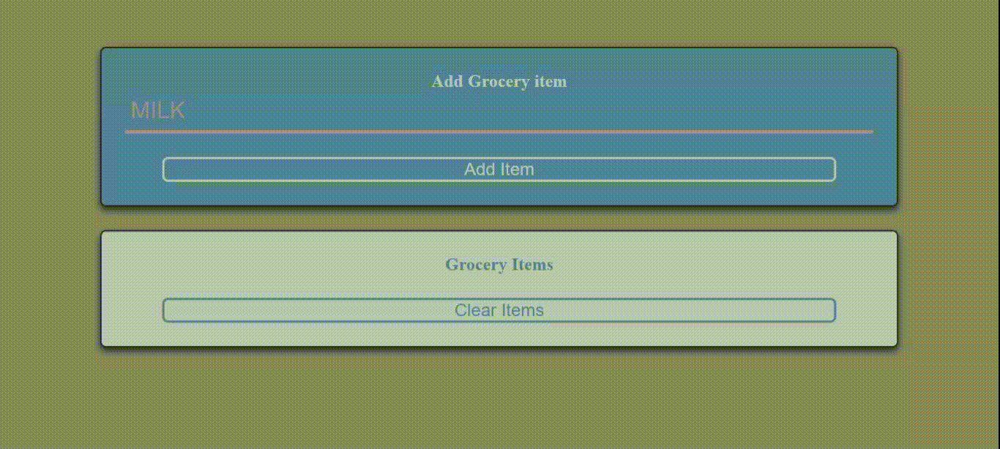

## Grocery List Project.

> This is a Grocery list project which can store your grocery items list 

* User can add any item to the list.
* User cannot add an empty value to the list
* EVery item has a delete option denoted by a Trash symbol.
* Clear Items button can delete all the list items.
* Permanent storage of elements into the local storage is not implemented yet. (will be implemented soon..)

